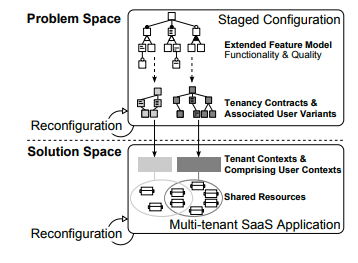
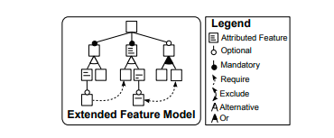
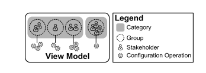
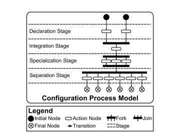
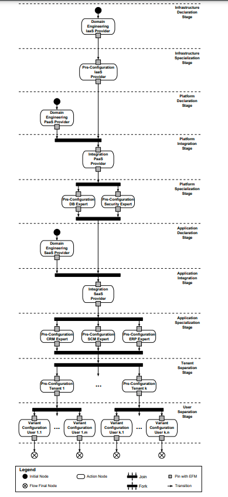
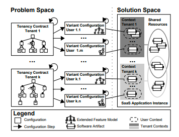

# Dynamic Configuration Management of Cloud-based Applications

Julia Schroeter TU Dresden julia.schroeter@tudresden.de

Peter Mucha, Marcel Muth, Kay Jugel SAP Research Dresden {peter.mucha, marcel.muth, kay.jugel}@sap.com

Malte Lochau TU Braunschweig lochau@ips.cs.tu-bs.de

## ABSTRACT

Cloud-based applications are multi-tenant aware, whereas customers (i.e., tenants) share hardware and software resources. Offering highly configurable applications to thousands of tenants in a shared cloud environment demands for scalable configuration management. Based on an example scenario taken from the Indenica project, we identify requirements for applying methods from software product line (SPL) engineering to configure cloud-based multi-tenant aware applications. Using an extended feature model (EFM) to express variability of functionality and service qualities, we propose a concept for dynamic configuration management to address the identified requirements. Our proposed configuration management includes an adaptive staged configuration process that is capable of adding and removing stakeholders dynamically and that allows for reconfiguration of variants as stakeholders’ objectives change.

## Categories and Subject Descriptors

D.2.13 [Reusable Software]: Domain engineering; 

D.2.9 [Management]: Software configuration management

## General Terms
Software, Software Engineering, Management, Software configuration management

## Keywords
Staged Configuration, Extended Feature Model, Cloud Computing, Multi-Tenancy

### 1. INTRODUCTION

In cloud computing, applications are provided on-demand as a self-service [5]. Commonly, a software as a service(SaaS) application is hosted by a provider in the cloud, rented to multiple customers (called tenants) and accessed by the tenants’ users over the internet [7]. In addition, application resources are shared among tenants. In the provisioning of a SaaS application, various stakeholders with different objectives are involved, i.e., providers of all cloud stack layers as well as tenants and their users [18, 26]. Thus, providing highly configurable SaaS applications for a large number of tenants and their associated users in a shared cloud environment demands for a dynamic, yet scalable configuration management to support for multiple stakeholders. Methods from software product line (SPL) engineering are convenient to handle the commonality and variability of SaaS applications as stated in the literature [20, 24, 26]. Furthermore, providing views for different stakeholders can be achieved by applying staged configuration [8, 12, 23]. We show in Fig. 1 how a multi-tenant SaaS application is configured by applying a staged configuration process. Tenancy contracts define the provisioned application functionality as well as quality of service (QoS) guarantees. Thus, an extended domain feature model (EFM) with attributes is convenient to express this variability and a staged configuration as proposed by Czarnecki et al. is applicable to create those contracts in the problem space [8]. Some configuration steps, e.g., performed by tenants, are independent from each other. However, others are dependent, e.g., a tenant’s configuration choices depend on the pre-configuration of the provider. Therefore, a structured configuration process is needed. In addition, stakeholders’ objectives may change over time, e.g., if a tenant decides to change the tenancy contract. Thus, the configuration process needs to support reconfiguration of stakeholder pre-configurations and subsequent ones being further affected. In contrast to conventional SPL engineering, multiple tenancy contracts and user variants are derived, but integrated into a single application instance in the solution space. Thus, in a shared cloud environment, variants are independent in the problem space, but become dependent in the solution space. To handle the variability in the solution space, a self-adaptive application architecture is proposed in [26]. In this paper, we focus on managing the variability of cloud-based applications in the problem space.

Figure 1: Configuration and instantiation of a cloudbased application.

The contribution of this paper is twofold. First, we report requirements for a configuration management of cloudbased applications in the problem space identified in an industry project. Second, we propose a dynamic configuration management that addresses the identified requirements. It comprises the definition of the configuration domain, the model-based specification of a generic configuration process, as well as life cycle management of tenancy contracts and user configurations with reconfiguration support. To limit a stakeholder’s configuration operations, we propose a viewbased concept on the EFM. The set of stakeholders may change as well as a stakeholder’s objectives and associated configurations. Thus, our proposed configuration management is dynamic.

The structure of this paper is as follows. We describe the context of our work in Sect. 2, explain the concepts of our configuration management by means of a case study in Sect. 3 and discuss drawbacks and benefits of the approach in Sect. 4. Finally, we present related work in Sect. 5 and conclude in Sect. 6.

### 2. CLOUD-BASED APPLICATIONS

In this section, we describe the characteristics of cloud applications in general and of one example platform in particular. We use this as a basis to identify the requirements a configuration process has to satisfy.

#### 2.1 Characteristics

The term cloud computing is used to describe the approach of providing IT resources as a service according to the National Institute of Standards and Technology (NIST) [18]. Resources are thereby dynamically scaled and customized depending on the demand of a tenant and its users and are associated with the three layers of the cloud computing stack, i.e., infrastructure as a service (IaaS), platform as a service (PaaS) and SaaS. While IaaS provides resources such as hardware and associated software as a service on-demand, PaaS focusses on the provisioning of an application development and deployment platform. Application software is rented to customers on-demand in the SaaS business model. This enables flexible pricing models. Tenants pay only for the services they use and for a certain usage time. Thus, tenancy contracts are likely to change rapidly.

We focus on configurable cloud applications that allow tailoring the applications functionality and quality. To save costs, such applications are multi-tenant aware on various levels. On hardware level, resources like server nodes and databases are shared. On platform level, various tenants use the same platform, which is configured accordingly. On application level, a single application instance is shared by different tenants [7]. To support multi-tenancy on configuration level, different authors propose to apply SPL techniques to handle commonality and variability among tenants [20, 24, 26].

#### 2.2 Illustrative Example

In this section, we present a sample configuration and reconfiguration scenario. As a case study, we consider the platform used in the Indenica project1 with extensions towards multi-tenancy [14]. The main purpose of this project is to abstract from service heterogeneity in a service-oriented environment. When developing a service-based application, a developer can make use of a multitude of service platforms. Choosing a platform entails the available services for potential applications developed on that platform.

On the one hand, we use the Indenica project to demonstrate our approach by means of an example regarding the different layers of the cloud stack and multiple stakeholders involved. On the other hand, Indenica already offers variability on platform level using SPL techniques.

Indenica employs SPL techniques to create a multi-tenant aware virtual service platform (VSP) as an abstraction layer. By providing a VSP that abstracts, integrates and enhances external services, an application developed on top of this platform is independent of the underlying services and can make use of enriched features provided by the virtual platform itself, e.g., multi-tenancy.

As a running example, we consider SaaS applications as the result of combining three external platforms, an enterprise resource planning (ERP), supply chain management(SCM) and a customer relationship management (CRM)system. Each of these systems provides specific customizable services. For example an ERP system delivers services like inventory accounting, sales management, human resource planning and many others. These are configurable to meet customer needs. These systems are integrated in a central platform, the VSP, which is multi-tenant aware. Tenants are possible SaaS providers with developers as potential users. On top of the VSP, multi-tenant aware SaaS applications offer business related services to tenants and users to manage their business using one combined application. These tenants, again, have specific demands concerning functional variability and quality constraints.

Several platforms and even more stakeholders are involved in the development and configuration of the solution, e.g., a virtual service platform provider, organizations, developers, and the external platforms providers. Dependencies among several stakeholders exist, for example organizations renting the VSP depend on the VSP provider. Thus, the configuration of the VSP provider has to be performed first. Each of these stakeholders has different responsibilities during the configuration process as well as configuration grants, both restricting possible decisions. For instance, SaaS users should not be allowed to configure the used database as this is the responsibility either of the provider, or of the tenant. The need to support reconfiguration in the configuration management arises as upstream providers may change their configuration decisions which need to be propagated to various downstream stakeholders. Additional diversity is introduced by the variable number of stakeholders, e.g., tenants could be added or removed during or after the configuration process.

The deployed platforms as well as the VSP itself are SPLs and are configured in a staged process in Indenica. The resulting configurations per tenant vary and are independent from each other in the problem space. In contrast to standard SPL engineering, where application variants are derived and instantiated independently, in a SaaS environment, derived configuration variants are integrated in a single application instance. Thus, variant configurations are independent in the SPL problem space, but become dependent in the solution space. At runtime, a tenant configuration is instantiated as a tenant context. Those contexts are dependent because they are integrated in the same application instance and, therefore, resources (e.g., software, hardware, databases) are shared. To handle the runtime dependency of supposed independent configurations, a selfadaptive application architecture is proposed in [26].

#### 2.3 Requirements for Configuration Management of Cloud-based Applications

Based on the example scenario, as well as expert talks and online search, we identified various requirements for configuration management of cloud-based applications. We asked domain experts in cloud computing with an academic background, i.e., researchers working in the Indenica project, as well as experts with an industrial background, i.e., product managers from SAP AG, about their requests for configuration management. Additionally, we analyzed articles published online, e.g., in the cloud computing journal2 , explaining advantages, drawbacks and open issues in configurable state-of-the-art application.

Requirement 1. Configuration of functional variability and quality constraints.

As mentioned before, stakeholders have varying requirements on functionality and QoS. Therefore, we need to handle the variability of both. Stakeholders’ objectives consider functional variability and variability among quality constraints, e.g., performance, availability, and the server location. For instance, a tenancy contract between application provider and tenant defines general terms, e.g., the duration of the tenancy and how application support is provided, as well as technical conditions, e.g., provisioned application functionality as well as QoS guarantees, e.g., adhering levels of availability, security, geographical, and legal restrictions.

Requirement 2. Stakeholder views.

Various stakeholders with different objectives are involved in the provision of cloud-based applications, whereas each stakeholder eliminates some variability of the configuration space according to the stakeholder’s concerns. For instance, a provider configures fundamental application properties, whereas a tenant only chooses from high-level application functionality and QoS offerings. Therefore, a view concept is needed, that defines the configuration operations a stakeholder is allowed to perform on the EFM.

Requirement 3. Structured configuration process.

As some stakeholder decisions have global and others have only local impact, the configuration process needs to be structured. As mentioned in our example, changes made by the VSP provider impact remaining configuration choices for other stakeholders. For instance, the application and platform providers make global pre-configurations valid for all tenants and their users whereas users eliminate left-over configuration choices eventually leading to a completely configured variant. Therefore, a configuration process needs to be structured accurately.

Requirement 4. Merging the configuration process and joining the paths leads to completely configured variants. 

For combining the ERP, SCM and CRM systems, independent configurations have to be joined during the configuration process. Prior to this, the separate configuration processes (for each platform) are concurrent and do not impact each other.

Requirement 5. Separating the configuration process and multiplying the paths that lead to variant configurations.

Some stakeholders conduct configuration operations that lead to independent variants, e.g., the pre-configuration performed by a tenant affects the configurations of the tenant’s users. However, the pre-configuration of one tenant does not affect the configuration decisions of another tenant. Therefore, the configuration process needs to support separation of configuration paths that lead to completely configured variants.

Requirement 6. Integrating stakeholders dynamically. 

In a cloud application, not all tenants and their users are known explicitly during application design time. In our example, new customers will be added and removed dynamically. Therefore, the configuration process has to be capable of adding and decommissioning stakeholders at runtime.

Requirement 7. Reconfiguration of variants.

As stakeholder objectives change, e.g., if a tenant decides to rent different functionality, the tenant’s configuration needs to be reconfigured. In a staged configuration process, downstream configuration decisions are affected by this reconfiguration and probably need to be changed as well. 

In the following, we propose a dynamic configuration process that addresses the identified requirements.

### 3. CONFIGURATION MANAGEMENT

In this section, we describe our concepts of a dynamic configuration management including staged configuration processes that address the requirements identified in Sect. 2.3. The concepts incorporate EFMs and provide the pragmatics for consistent staged configuration processes integrating multiple views for different stakeholders. We further provide concepts for reconfiguration occurring on various stages and discuss how to verify the configuration process. We outline a sample dynamic configuration process using the example described in Sect. 2.2.

#### 3.1 Configuration Specification

The proposed configuration management is based on an extended feature model, a view model, a configuration process model, and the mappings between them. Their composition defines a dynamic staged configuration process. We decided to use separate models to enable reuse, to reduce complexity of the configuration process, and to ensure separation of concerns (SoC) [8]. In the following, we elaborate on the proposed models.

Figure 2: The extended feature model describes variability and commonality among functionality and quality properties.

##### 3.1.1 Extended Feature Model

Utilizing an EFM addresses Req. 1. Various extensions of feature models exist [3]. We use an EFM with mixed constraints and group cardinalities as described by Benavides et al. [2]. In EFMs, features are enhanced by sets of attributes over finite, discrete value domains [21]. We express the application functionality as features and quality configuration options by feature attributes, which addresses Req. 1. Our EFM incorporates a graphical front-end as shown in Fig. 2, where we use feature diagrams as initially proposed in feature oriented domain analysis (FODA) [15]. Feature diagrams organize sets of features in a tree-like hierarchical structure. According to [25], we use a cardinality-based syntax to denote valid ranges (k..l) of sibling feature nodes to be selected from groups with n features. In particular, cardinality (n..n) denotes mandatory, (0..n) optional, (1..1)alternative, and (1..n) or groups. To provide fully expressive (i.e., conceptional complete) feature models, feature diagrams have to further include propositional formulas over features arbitrarily crossing tree hierarchies to specify constraints on valid product configurations [25]. These feature constraints are usually given as require and exclude edges between two features.

From a user’s point of view, domain features organized in a feature diagram represent selectable product characteristics [15]. Thus, features are not limited to increments of functionality, such as particular service implementations, but rather also represent quality criteria of interest. These extra-functional properties are not just selectable or deselectable for product configurations but further allow for a more fine-grained valuation by means of explicitly quantifiable attributes [2]. These sets of feature attributes and their interdependencies are further constrained by means of conditional expressions over attributes [16, 21]. Formal semantics of EFMs are given in [16, 17].

##### 3.1.2 View Model

Using a view model (VM) addresses Req. 2. The concepts of role based access control (RBAC) as formalized by Ferraiolo and Kuhn [10] could provide a basis for our VM. In general, each configuration operation applied during a configuration process is explicitly dedicated to a stakeholder depending, e.g., on the concerns related to that particular configuration decision. Therefore, multi-view configuration approaches propose projections on feature models for different stakeholders. Each projection solely visualizes elements relevant for that particular stakeholder [1, 13]. However, for complex staged configuration processes with numerous heterogeneous stakeholders involved, a simple one-to-one correspondence between views and stakeholders is too restrictive. Instead, to support flexible n-to-m correspondences between views and feature models, unifying stakeholder categories with similar concerns as well as concerns dedicated to particular stakeholders are apparent. Thus, every stakeholder owns a tailored configuration view that integrates stakeholder relevant concerns only, which addresses Req. 2. To define views, we propose to use a VM as visualized in Fig. 3. A category corresponds to a stage in the configuration process model. A group is assigned to a category and subsumes stakeholders of the same kind and similar configuration operations. A stakeholder either represents a person, a member of an organization, or a third party that is involved in the configuration process and has certain concerns regarding the configuration of parts of the EFM. Views are defined by mapping configuration operations specified for the EFM onto groups and categories specified in the VM. Each configuration operation allows to bind variability until a feature model is created that corresponds to a variant configuration. According to Czarnecki et al. [8] configuration operations include refinement of group cardinalities, selection and de-selection of features, as well as setting attribute values. For staged configuration processes, feature models also offer operational interpretations by means of sequences of valid configuration operations applied by stakeholders.

Figure 3: The view model defines stakeholders and their views on the extended feature model.

##### 3.1.3 Configuration Process Model

Utilizing a configuration process model (CPM) addresses Req. 3, 4 and 5. We capture the orderings between configuration stages and stakeholders’ configuration steps in a CPM. Its main concepts are visualized in Fig. 4 as an activity diagram. The diagram defines a staged configuration process where each configuration stage reflects a stakeholder kind represented by a partition in the activity diagram. We distinguish four kinds of stages according to their purpose, i.e., declaration, specialization, integration, and separation stages. In a declaration stage the EFM is defined, which is used subsequently in the configuration process. All configuration steps of a specialization stage are applied to the same EFM. This stage has one EFM as input and the same EFM with a corresponding amount of variability bound as output. This kind of stage refers to that notion of stages as defined in [8]. An integration stage is intended to join multiple EFMs, which addresses Req. 4. This stage has multiple EFMs as input and a merged one as output. An integration stage corresponds to joining multi-product lines [22, 23]. In a separation stage each input EFM is split into multiple restricted EFMs, which addresses Req. 5. Additionally, dependent stages are ordered sequentially where independent stages are arranged in parallel.

Existing feature-model configuration processes [8, 12] are intended to derive a single product variant per process execution. In contrast, a configuration process for multi-tenant applications needs to derive multiple product variants as represented by multiple flow final nodes in the activity diagram.

Figure 4: The configuration process model structures stages and organizes configuration steps.

##### 3.1.4 Configuration Process Verification

To ensure overall consistency, the approach needs to include synchronization for concurrent stakeholder configurations [19]. Furthermore, a process verification needs to ensure that the configuration process is consistent w.r.t. the EFM. This is needed for error-correction and avoidance while it would also help users keeping track of their configurations. 

The set of configuration steps performed by a stakeholder lead to a globally consistent EFM that guarantees the derivation of valid variant configurations in subsequent steps. The translation of the EFM into a constraint satisfaction problem (CSP) allows to apply a CSP solver to check partial pre-configurations w.r.t. EFM consistency [4]. Applying methods from formal verification ensures that reconfiguration steps as well as configuration steps are starvation-free and the configuration process eventually yields a valid variant configuration. Such methods are needed to verify the soundness, completeness and termination of the overall configuration process.

#### 3.2 Dynamic Configuration Process

We illustrate our concepts of dynamic staged configuration processes using the case study explained in Sect. 2.2. The composition of the EFM, VM and CPM specifies the dynamic staged configuration process. We show the structure of the dynamic configuration process in Fig. 5. The outcome of the process are multiple user variant configurations. We use an activity diagram to visualize the process structure. Every stakeholder stage is represented as a partition and each stakeholder is assigned to a view specified in the VM, whereas a view restricts the stakeholder’s configuration operations.

The configuration process starts with the declaration of an EFM for every layer of the cloud stack in the respective declaration stages. The features of the infrastructure as well as platform and application are described the respective stages. Possible options and features are described in the EFMs. This could be possible databases on infrastructure level. On platform level, this could be possible options for modules to be used by the VSP. Finally, on application level, an EFM could describe possible configuration options such as different accounting strategies for an ERP system. Later, the EFM of the infrastructure layer will be integrated with the EFM of the platform layer. The resulting EFM will also be integrated with the application EFM in a next step. The intent of the integration is to consolidate multiple models to one resulting model, which is done in the integration stages. Before an EFM will be integrated with another one, it can be pre-configured at specialization stages. The specialization is split up into sub-activities according to the domain expert, e.g., the database expert and security expert in the platform specialization stage. Each expert configures the EFM partially, whereat the experts’ 

Figure 5: An example staged configuration process based on the Indenica case study.

##### 3.2.1 Dynamically Changing Stakeholders

Addressing Req. 6, the configuration process allows to change stakeholders during runtime of the application. According to other works [11, 6], configuration steps need to be changed, added, or removed in the process. For instance, if a new tenant is added, a new tenant contract is derived based on the pre-configuration of the application provider. Accordingly, the tenant contract builds the basis for a new user variant configuration, that is derived when a new user is added to the tenant. Furthermore, if a tenant or a user needs to be decommissioned, the variant configurations as well as the contracts are deactivated, accordingly.

##### 3.2.2 Staged Reconfiguration

To address Req. 7, our configuration process needs to support reconfiguration. Reconfiguration may occur at specialization and separation stages. If a stakeholder changes the partial configuration, subsequent configurations need to be changed likewise, depending on whether configuration decisions are affected. For instance, if a tenant changes the tenancy contract, the tenant’s users need to adjust their variant configurations, because their configurations refer to features or attribute values that are no longer selectable.

#### 3.2.3 Configuration Artifact

The dynamic configuration process results in different artifacts as shown in Fig. 6. In the problem space, the configuration steps performed by a tenant create a pre-configuration of the EFM with remaining variability, which is referred to as a tenancy contract. It describes the functionality of an application a tenant rents and the QoS agreements applicable for the tenant’s users. A tenancy contract builds the basis for deriving multiple variant configurations for a tenant’s users. In a user’s variant configuration, all variability is bound. In the solution space, user variant configurations are instantiated as user contexts in the SaaS application instance. The users of a tenant have their own user context, each conforming to a user variant configuration. The set of all user contexts describes a virtual tenant context. As various tenants are subscribed to a SaaS, multiple tenant contexts exist.

Figure 6: Configuration artifacts of the configuration process and their instantiation at runtime.

## 4. DISCUSSION

In this paper we describe various requirements and according research questions that we will address in future work. For instance, we need to elaborate on process verification techniques to ensure a correct configuration process. Another open issue is the synchronization of stakeholders that have overlapping views and who configure the same EFM in parallel. At this time, EFMs lack general tool support, including automated analysis and verification. However, we currently develop a prototypical tool for creating, instantiating and analyzing EFMs. Additionally, we need to keep in mind the correlation between variant configurations in the problem space and their instantiation in the solution space. Due to that, a reconfiguration in the problem space triggers reconfiguration in the solution space and therefore might have side effects because of shared hardware and software resources. Changing a feature in one place, might cause inconsistencies in a completely different place and thus reconfiguration in the application instance is not appropriate.

The configuration management we propose in this paper offers a dynamic solution to handle the variability among cloud-based applications with support for multiple stakeholders. It addresses the requirements discussed in Sect. 2.3 and provides a staged configuration technique that enables different stakeholders to control access to services and features of the application. The concept is intended to handle large numbers of tenants and users as this is a vital criterion in cloud computing. In particular, our configuration process supports tenant commissioning and decommissioning at application runtime. Further advantages of the presented approach are its flexibility and scalability. It is flexible in terms of configuration and reconfiguration for certain stakeholders and downstream stakeholder configurations and scalable in terms of the amount of stages as well as model artifacts as the example of the Indenica project shows. The approach supports the creation of multiple separate variant configurations as well as the integration of separated artifacts from multiple SPLs. Flexibility and scalability are crucial for ondemand applications. In addition, in an open environment like cloud computing, it is worth considering evolution in the configuration space. As new services become available, further variability needs to be added. This holds for changing and removing services, correspondingly.

Summarizing, the concept of the presented configuration management offers convenient maintenance and configuration mechanisms for cloud-based applications and platforms in a multi-tenant environment. It allows to handle the life cycle of variant configurations with multiple stakeholders involved and to check the consistency of the configuration process combined with formal work flow models.

## 5. RELATED WORK

In this section, we present work that is related to the concepts of our configuration management, which tackles different research fields.

Mietzner et al. propose using SPL techniques for configuring multi-tenant SaaS applications [20]. The authors propose a configuration process for creating tenant configurations using a feature model to describe application functionality. They argue that a tenant’s configuration decisions are influenced by already deployed application services and, therefore, restrict the configurable variability of new tenants. In our approach, tenants’ pre-configurations are not influenced by other tenants. Additionally, our approach covers the variability of quality properties and we use an EFM. Another concept of applying SPL techniques on configurable SaaS applications is given by Ruhl and Andelfinger [24]. During domain engineering, a catalog is created that describes the flexibility of the application. This catalog is then used to configure the application per tenant. In contrast, we use EFMs to model the functionality of the application as well as QoS and propose a staged configuration process to configure the application. Additionally, we focus on the configuration management of already created configurations. Czarnecki et al. introduced multi-level staged configuration using cardinality-based attributed feature models [8]. Passos et al. [21] characterize non-boolean features and constraints and provide a benchmark to analyze the EFM. In these approaches, specialization is the process consisting of multiple specialization steps to eliminate variability. The outcome is one configuration. We extend this concept by allowing the derivation of multiple configurations simultaneously and we allow for specialization steps that split and join configuration paths. Mendonca et al. [19] describe a process for coordinating collaborative product configurations using an annotated EFM with overlapping stakeholder views. Further view-oriented configuration processes based on feature models are proposed by Hubaux et al. [13, 12]. They introduce scheduled configuration workflows with limited views per stakeholder. A view is defined on a feature model to present only features relevant for a specific stakeholder. A workflow drives the configuration process based on these views. Our concepts are similar as we use a view concept for stakeholders in a scheduled configuration process. Additionally, we use EFMs with attributes in our configuration process and we provide a mechanism to allow reconfiguration of single configuration steps. Furthermore, our dynamic configuration process allows to derive multiple variant configurations that are independent from each other whereas configuration decisions of some stakeholders have global impact on many configurations and others have only local impact on a certain subset of variant configurations. As we support the integration of multiple feature models, research in multi-product lines is related to our work [22, 23, 9]. This work explicitly focuses on the configuration and integration of multiple variability models. In addition, our main focus is on the dynamic configuration process to create separate variant configurations and to allow for their reconfiguration. According to the stage where reconfiguration occurs, different variant configurations are reconfigured.

## 6. CONCLUSION

In this paper, we identified requirements for configuration management for cloud-based applications. We presented a concept of a dynamic configuration management that addresses the identified requirements comprising a model-based configuration process that is capable of handling the complexity and dynamics of configurations in a multi-stakeholder setting. As the configuration management of cloud-based applications tackles many different research fields, our approach benefits from incorporating research results from these domains. We will evaluate the applicability and scalability of our concepts on large scale case studies and elaborate on the process analysis to guarantee that configuration steps lead to valid variant configurations using work flow models to ensure soundness properties. Furthermore, we will integrate the formalized concepts of multi-perspectives into the proposed configuration process to support consistent EFM pre-configurations [27]. In our opinion, the concepts presented in this paper offer a convenient way to manage the configurations of cloud-based applications.

## Acknowledgements

The authors like to thank the reviewers for their very valuable comments. This research is co-funded by the European Social Fund, Federal State of Saxony and SAP AG in the research project #080949335 and by the European Commission within the Indenica project as part of the 7th Framework Programme in the area Internet of Services and Software & Virtualisation (ICT-2009.1.2).

## 7. REFERENCES

[1] M. Acher, P. Collet, P. Lahire, and R. B. France. Separation of concerns in feature modeling: support and applications. In Proceedings of Aspect Oriented Software Development (AOSD ’12), pages 1–12. ACM,2012.

[2] D. Benavides, P. T. Mart´ın-Arroyo, and A. R. Cort´es. Automated reasoning on feature models. In Proceedings of the 17th International Conference on Advanced Information Systems Engineering (CAiSE ’05), pages 491–503. Springer, 2005.

[3] D. Benavides, S. Segura, and A. R. Cort´es. Automated analysis of feature models 20 years later:A literature review. Journal of Information Systems, 35(6):615–636, 2010.

[4] D. Benavides, S. Segura, P. T. Mart´ın-Arroyo, and A. R. Cort´es. Using java csp solvers in the automated analyses of feature models. In Proceedings of the Generative and Transformational Techniques in Software Engineering, International Summer School(GTTSE ’05), pages 399–408. Springer, 2005.

[5] K. H. Bennett, P. J. Layzell, D. Budgen, P. Brereton, L. A. Macaulay, and M. Munro. Service-based software: the future for flexible software. In Proceedings of the 7th Asia-Pacific Software Engineering Conference (APSEC ’00), pages 214–221. IEEE Computer Society, 2000.

[6] F. Casati, S. Ceri, B. Pernici, and G. Pozzi. Workflow evolution. Journal of Data and Knowledge Engineering, 24(3):211–238, 1998.

[7] F. Chong and G. Carraro. Architecture strategies for catching the long tail. Website, 2006. http://msdn.microsoft.com/en-us/library/aa479069.aspx.

[8] K. Czarnecki, S. Helsen, and U. Eisenecker. Staged configuration through specialization and multi-level configuration of feature models. Journal of Software Process: Improvement and Practice, 10(2):143–169,2005.

[9] D. Dhungana, D. Seichter, G. Botterweck, R. Rabiser, P. Grunbacher, D. Benavides, and J. Galindo. ¨ Configuration of multi product lines by bridging heterogeneous variability modeling approaches. In Proceedings of the 15th International Conference(SPLC ’11), pages 120–129, 2011.

[10] D. Ferraiolo and D. Kuh. Role based access control. In Proceedings of the 15th National Computer Security Conference (NCSC ’92), pages 554–563, 1992.

[11] J. J. Halliday, S. K. Shrivastava, and S. M. Wheater. Flexible workflow management in the openflow system. In Proceedings of 5th International Enterprise Distributed Object Computing Conference (EDOC ’01), pages 82–92. IEEE Computer Society, 2001.

[12] A. Hubaux, A. Classen, and P. Heymans. Formal modelling of feature configuration workflows. In Proceedings of the 13th International Conference(SPLC ’11), pages 221–230. ACM, 2009.

[13] A. Hubaux, P. Heymans, P.-Y. Schobbens, D. Deridder, and E. Abbasi. Supporting multiple perspectives in feature-based configuration. Software and Systems Modeling, 10:1–23, 2011. 10.1007/s10270-011-0220-1.

[14] Indenica Consortium. View-based design time and runtime architecture for tailoring vpss. Indenica Project Deliverable D3.1, 2012.

[15] K. C. Kang, S. G. Cohen, J. A. Hess, W. E. Novak, and A. S. Peterson. Feature-oriented domain analysis(foda) feasibility study. Technical report, Carnegie Mellon University Pittsburgh, Software Engineering Institute, 1990.

[16] A. S. Karatas, H. Oguztuz¨ un, and A. H. Dogru. ¨ Mapping extended feature models to constraint logic programming over finite domains. In Proceedings of the 14th International Software Product Line Conference (SPLC ’10), pages 286–299, 2010.

[17] R. Mazo, C. Salinesi, D. Diaz, and A. Lora-Michiels. Transforming attribute and clone-enabled feature models into constraint programs over finite domains. In Proceedings of the 6th International Conference on Evaluation of Novel Approaches to Software Engineering (ENASE ’11), pages 188–199. SciTePress,2011.

[18] P. Mell and T. Grance. The nist definition of cloud computing. NIST Special Publication 800-145, National Institute of Standards and Technology, Information Technology Laboratory, 2011.

[19] M. Mendon¸ca, D. D. Cowan, and T. C. de Oliveira. A process-centric approach for coordinating product configuration decisions. In Proceedings of the 40th Hawaii International International Conference on Systems Science (HICSS ’07), page 283. IEEE Computer Society, 2007.

[20] R. Mietzner, A. Metzger, F. Leymann, and K. Pohl. Variability modeling to support customization and deployment of multi-tenant-aware software as a service applications. In Proceedings of the Workshop on Principles of Engineering Service Oriented Systems(PESOS ’09), pages 18–25, Washington, DC, USA,2009. IEEE Computer Society.

[21] L. T. Passos, T. Berger, M. Novakovic, K. Czarnecki, Y. Xiong, and A. Wasowski. A study of non-boolean constraints in variability models of an embedded operating system. In Proceedings of the 15th International Software Product Line Conference, Volume 2, pages 2:1–2:8, 2011.[22] M.-O. Reiser and M. Weber. Multi-level feature trees. Journal of Requirements Engineering, 12(2):57–75,2007.

[23] M. Rosenmuller and N. Siegmund. Automating the ¨ configuration of multi software product lines. In Proceedings of the fourth International Workshop on Variability Modelling of Software-Intensive Systems(VaMoS ’10), volume 37 of ICB-Research Report, pages 123–130. Universit¨at Duisburg-Essen, 2010.

[24] S. T. Ruehl and U. Andelfinger. Applying software product lines to create customizable software-as-a-service applications. In Proceedings of the 15th International Software Product Line Conference, Volume 2, pages 16:1–16:4. ACM, 2011.

[25] P.-Y. Schobbens, P. Heymans, and J.-C. Trigaux. Feature diagrams: A survey and a formal semantics. In Proceedings of 14th IEEE International Conference on Requirements Engineering (RE ’06), pages 136–145. IEEE Computer Society, 2006.

[26] J. Schroeter, S. Cech, S. G¨otz, C. Wilke, and U. Aßmann. Towards modeling a variable architecture for multi-tenant saas-applications. In Proceedings of the sixth International Workshop on Variability Modelling of Software-Intensive Systems (VaMoS ’12), pages 111–120. ACM, 2012.

[27] J. Schroeter, M. Lochau, and T. Winkelmann. Multi-perspectives on feature models. In (To appear)Proceedings of the 15th International Conference on Model Driven Engineering Languages and Systems(MODELS ’12). Springer, 2012.